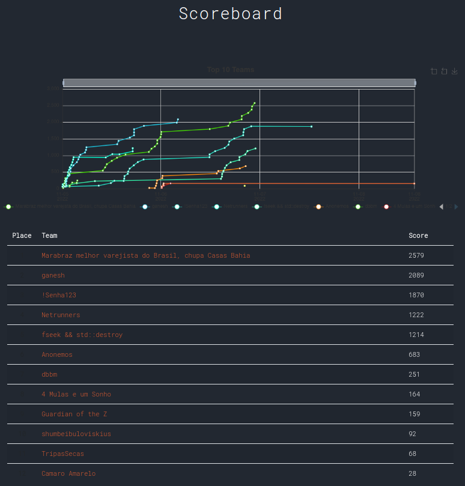

# [E]ACH InTheShell_ 2022

Repositório dos desafios realizados durante a Semana de Sistema de Informação de 2022.

#### Scoreboard

Time vencedor: `Marabraz melhor varejista do Brasil, chupa Casas Bahia`

[Write-up do time vencedor](./Write up CTF.pdf)

#### Tópicos abordados

- bin/rev - Interessados: Jadno, Mayfly
- crypto - Interessados: Azz, Furquim
- forense - Interessados: Azz, Jadno, Nakata
- OSINT - Interessados: Uxie, Nakata, Furquim
- redes - Interessados: Nominho Hacker, Nakata, Jadno, Mayfly, Furquim
- web - Interessados: Nominho Hacker, Jadno
- misc - Interessados: Lari, Mayfly

#### Ideias/temas soltos

Brainstorm, pode ser que não seja utilizado...

- Link de bibliotecas dinâmicas
- Modificar/implementar algum programa (tipo o `scp`) para subverter a lógica de algum programa externo
- Escape de container
- Forense com memory dump de um computador
- Analise de pacotes com Wireshark
- Zip slip
- Log4J
- GDB com sessão remota aberta
- XSS
- SSRF
- Alguma possibilidade de RCE em algum tipo de programa distribuído (`distcc`, `barrier`)?
- Desafios de exploração de binário (stack overrun, format string, heap overrun, integer overflow)

#### Portas já utilizadas

Evitem reutilizar portas ;)

| Desafio                             | Porta |
| ----------------------------------- | ----- |
| Proxy Aberto                        | 3128  |
| Um Ladino nos Fios                  | 47000 |
| Calculadora Preguiçosa              | 47002 |
| Uma Cabeça Cheia de Informações     | 47100 |
| Zip Simbólico                       | 47101 |
| Tudo Nada Filtrado                  | 47200 |
| ShellCode para Iniciantes           | 47300 |
| Fabrica de ShellCode                | 47301 |
| Overflow Para Bebes                 | 47302 |
| Agora Você no Controle              | 47303 |
| Para Onde Voltar                    | 47304 |
| Um Passo Para Tras Dois Para Frente | 47305 |
| Many Time Pad                       | 47400 |
