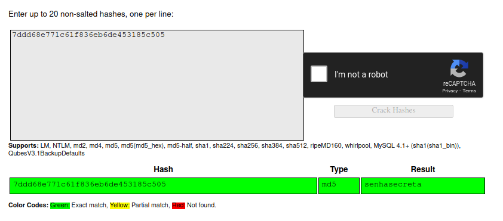

# Introdução ao HASH

Responsável: Tsu

Tags: `hash`, `hashcat`

## Desafio

O hash é uma função de via única, ou seja não pode ser decriptografado.

Mas pode existir uma forma de descobrir qual foi o valor de entrada de um hash...

Qual é o valor que gerou o seguinte resultado `7ddd68e771c61f836eb6de453185c505` utilizando o MD5?

## Dica

Já ouviu falar no `crackstation`? - 5 pts

## Resolução proposta

Usar algum site como o [crackstation](https://crackstation.net/) pela internet.

## Como rodar

O código fonte vai estar disponibilizado no site do `ctfd/ctfd`.
