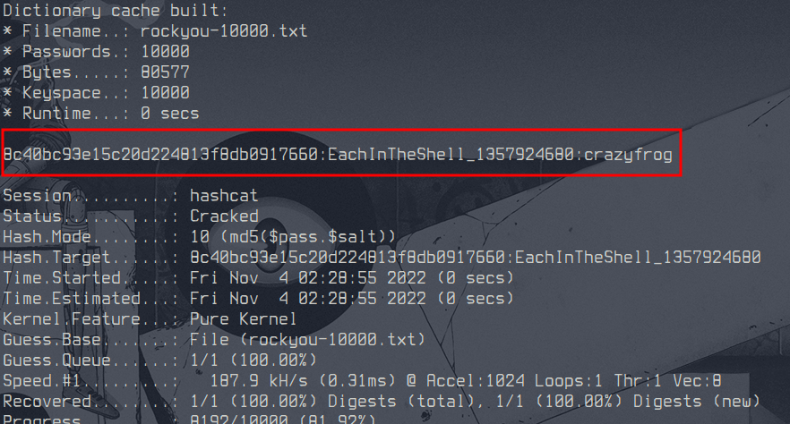

# Introdução ao HASH

Responsável: Tsu

Tags: `hash`, `hashcat`

## Desafio

Jiji usou uma função hash em sua senha junto com um `sal`

Você consegue recuperar a senha de Jiji usnado a wordlist `rockyou.txt`?

**OBS**: Jà ouviu falar no `hashcat`?

## Resolução proposta

Usando o programa `hashcat` que foi recomendado, podemos rodar o seguinte comando:

```sh
hashcat -m 10 hash.txt rockyou-10000.txt
```

Obtendo o seguinte resultado:



## Como rodar

O código fonte vai estar disponibilizado no site do `ctfd/ctfd`.
