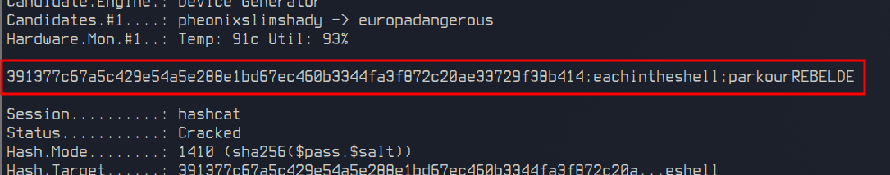

# Hash com regras?

Responsável: Tsu

Tags: `hash`, `hashcat`

## Desafio

Sabemos que Jiji tem uma combinação de 2 das palavras dentro do arquivo `rockyou-10000.txt`, mas não sabemos quais...

Vamos descobrir a senha de Jiji?

**OBS**: O hash não é mais o MD5

## Resolução proposta

Usando o programa `hashcat` que foi recomendado, podemos rodar o seguinte comando:

```sh
hashcat -m 1410 -a 1 hash.txt rockyou-10000.txt rockyou-10000.txt
```

Obtendo o seguinte resultado:



## Como rodar

O código fonte vai estar disponibilizado no site do `ctfd/ctfd`.
