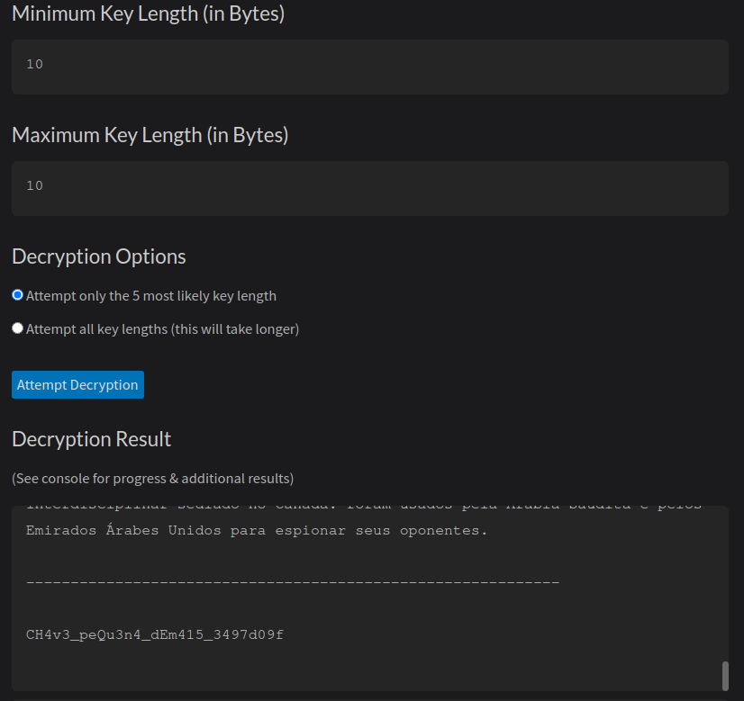

# XOR - Short key

Responsável: Tsu

Tags: `xor`, `python3`

## Desafio

Jiji deixou para trás um arquivo criptografado, mas dessa vez Jiji está usando uma chave maior.

O que é esse texto criptografado?

## Resolução proposta

Um dos sites que foi indicado durante os encontros abertos foi o [CyberChef](https://cyberchef.org/).

Nesse desafio, nós sabemos que foi usado a operação XOR no `texto_criptografado.txt`

Usando a ferramenta `XOR Brute Force` no arquivo `texto_criptografado.txt`, é possível reconhecer alguns padrões dentro do arquivo:

Com esses padrões é possível chutar que partes do arquivo continham o mesmo texto repitido dentro dele, calculando tamanho das repetições é possível saber que o tamanho da chave é de 10 caracteres.

Outra forma de resolver seria usar um site como XOR [craker](https://wiremask.eu/tools/xor-cracker/)

O site analisa o arquivo e da um chute do tamanho provável da chave. Assim descobrimos o tamanho de 10 caracteres

Para a decriptografia seria possíve usar esse [site](https://node-security.com/posts/xor-encryption-cracker/) ou criar um próprio script

Sabendo o tamanho da flag é preciso apenas colocar como entrada dentro do site:

## Como rodar

O código fonte vai estar disponibilizado no site do `ctfd/ctfd`.
