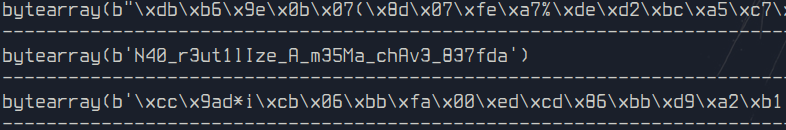

# XOR - Bad One Time Pad

Responsável: Tsu

Tags: `xor`, `python3`

## Desafio

Jiji também fez uma implementação de um algoritmo e te enviou. Mas, dessa vez Jiji está usando uma chave maior.

Consegue pegar a flag de Jiji?

Teste a implementação da Jiji aqui:

nc 

**OBS:** O começo do conteúdo do arquivo *flag.txt* pode não ter sido criptografado junto com o começo da chave

## Resolução proposta

Para resolver esse problema, primeiro pegamos a chave inteira:

O resto da resolução pode ser encontrado no arquivo `solution.py`

Rodando o `solution.py` obtemos a flag:

## Como rodar

O código fonte vai estar disponibilizado no site do `ctfd/ctfd`.
