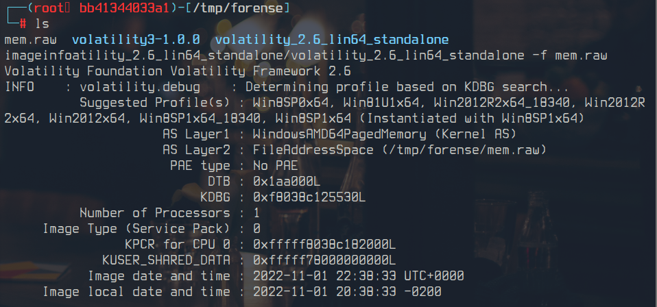
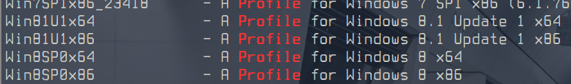

# Dump - Arquivo

Responsável: Tsu

Tags: `volatility`

## Desafio

Conseguimos invadir o computador de Jiji e pegar um dump de memória, o que Jiji esconde em seu computador?

Link para o dump: https://drive.google.com/file/d/152E6ePtriehTVk3bDr_PcrEmyjC4JRFV/view?usp=sharing

Sha1sum: 775e7bb33f185fd967dca020b41560c41d4876de

Para verificar o hash do arquivo no Linux rode:

```sh
sha1sum jiji_mem.raw
```

Para verificar o hash do arquivo no Windows rode:

```sh
CertUtil -hashfile mem.raw sha1
```

Qual é o profile utilizado para analizar esse dump de memória no volatility 2?

**Dica**: O computador da Jiji é um windows de 64-bits (Essa informação vai ser importante)

## Resolução proposta

Rodar o comando:

```sh
volatility --info | grep -i profile
```



Procurando pelos profiles é possível achar os profiles:



O desafio aceita qualquer resposta que começa com Win8 e termina com x64

## Como criar uma imagem

Usar o [winpmem](https://github.com/Velocidex/WinPmem) para criar a imagem.

Não obtive muito sucesso criando dumps do windows 10, mas o windows 8.1 deu certinho

## Como rodar

O código fonte vai estar disponibilizado no site do `ctfd/ctfd`.
