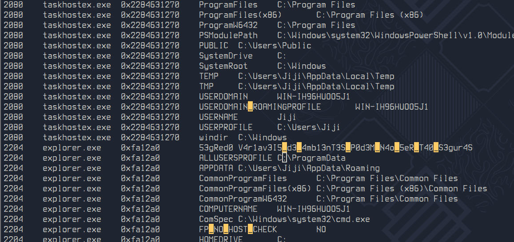

# Dump - Flag #1

Responsável: Tsu

Tags: `volatility`

## Desafio

O dump de memória pode ser encontrado no desafio `Dump - Arquivo`

Jiji disse que existe algo no ambiente... O que Jiji quis dizer com isso?

## Dicas

Isso! Isso mesmo! Me lembrei agora! Eram variáveis de ambiente - 5 pontos

## Resolução proposta

A primeira flag é a flag que está nas variáveis de ambiente.

Para abrir o dump de memória é necessário usar o volatility.

Esse [site](https://book.hacktricks.xyz/generic-methodologies-and-resources/basic-forensic-methodology/memory-dump-analysis/volatility-cheatsheet) é um bom lugar para referências.

Para ver o dump das variáveis de ambiente usando o volatility 3:

```sh
python3 volatility3-1.0.0/vol.py -f jiji_mem.raw windows.envar
```

Para ver o dump das variáveis de ambiente usando o volatility 2:

```sh
volatility -f mem.raw --profile Win81U1x64 envars
```

Então é só analisar a saída e procurar pela flag. No exemplo abaixo eu procurei pelas aparições do caractere `_` que geralmente aparece nas flags:



## Como rodar

O código fonte vai estar disponibilizado no site do `ctfd/ctfd`.
