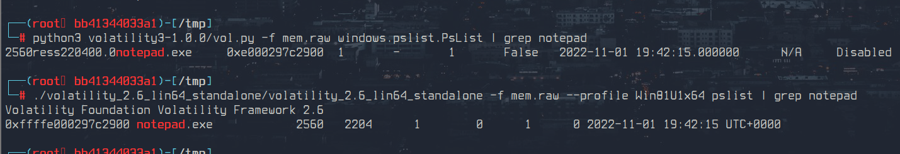
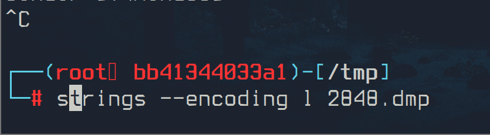
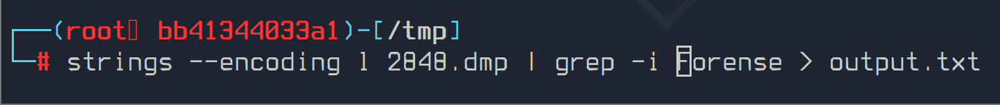
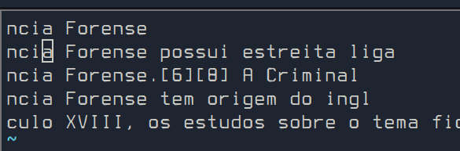
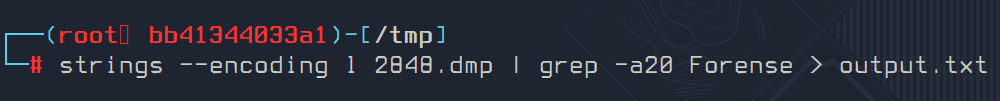
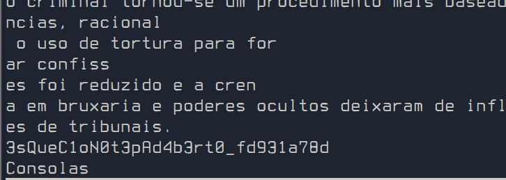
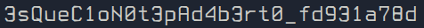

# Dump - Flag #2

Responsável: Tsu

Tags: `volatility`

## Desafio

O dump de memória pode ser encontrado no desafio `Dump - Arquivo`

Tenho uma impressão que Jiji estava escondendo um segredo na sua anotação de computação forense...

## Dicas

Jiji gosta de fazer suas anotações no `notepad.exe` - 5 pontos

## Resolução proposta

A segunda flag é a flag que está no processo aberto do `notepad.exe`

Para abrir o dump de memória é necessário usar o volatility.

Esse [site](https://book.hacktricks.xyz/generic-methodologies-and-resources/basic-forensic-methodology/memory-dump-analysis/volatility-cheatsheet) é um bom lugar para referências.

Para ver os processos abertos (volatility 3):

```sh
python3 volatility3-1.0.0/vol.py -f jiji_mem.raw windows.pslist.PsList
```

Para ver os processos abertos (volatility 2):

```sh
volatility -f jiji_mem.raw --profile Win81U1x64 pslist
```



Então, é preciso extrair o processo `notepad.exe`:

```sh
python3 volatility3-1.0.0/vol.py -f jiji_mem.raw windows.dumpfiles.DumpFiles --pid 2560

# OU

volatility -f jiji_mem.raw --profile Win81U1x64 memdump --dump-dir=./ -p 2560
```

Para conseguir ler o conteúdo do `notepad.exe` é preciso usar uma codificação específica:



Sabendo que Jiji estava estudando computação forense, é possível filtrar a palavra `forense`:



A saída não contém o texto inteiro:



Então rodamos o `grep` novamente com a flag `-a`:



Então ao analisar a saída, encontramos a flag:





## Como rodar

O código fonte vai estar disponibilizado no site do `ctfd/ctfd`.
