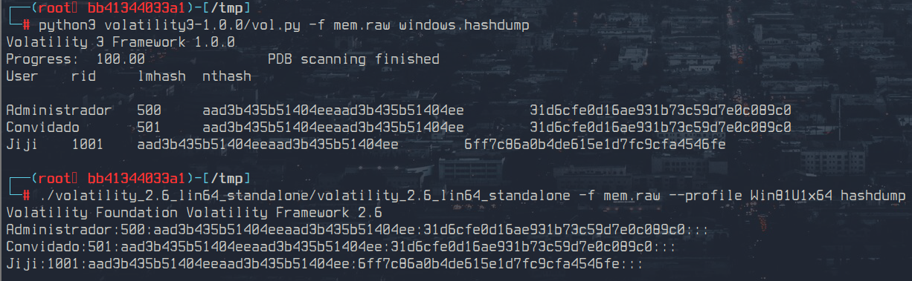

# Dump - Flag #3

Responsável: Tsu

Tags: `volatility`

## Desafio

O dump de memória pode ser encontrado no desafio `Dump - Arquivo`

Será que a gente consegue pegar o NT hash da senha de Jiji?

## Resolução proposta

A terceira flag é o hash da senha de Jiji

Para abrir o dump de memória é necessário usar o volatility.

Esse [site](https://book.hacktricks.xyz/generic-methodologies-and-resources/basic-forensic-methodology/memory-dump-analysis/volatility-cheatsheet) é um bom lugar para referências.

Para ver as senhas dos usuários (volatility 3):

```sh
python3 volatility3-1.0.0/vol.py -f jiji_mem.raw windows.hashdump
```

Para ver as senhas dos usuários (volatility 2):

```sh
volatility -f mem.raw --profile Win81U1x64 hashdump
```



Por curiosidade a senha era `Mysecret`

## Como rodar

O código fonte vai estar disponibilizado no site do `ctfd/ctfd`.
