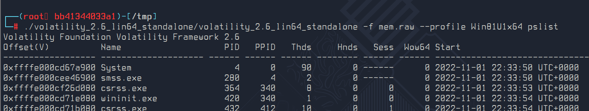
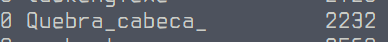
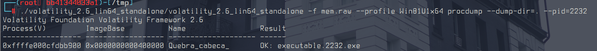
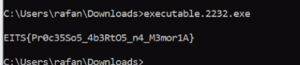

# Dump - Flag #4

Responsável: Tsu

Tags: `volatility`

## Desafio

O dump de memória pode ser encontrado no desafio `Dump - Arquivo`

Jiji estava rodando um executável quando pegamos o dump de memória.

Você consegue recuperar o executável e seu conteúdo?

## Dicas

Encontrou o arquivo? Já tentou executar o arquivo? - 5 pontos

## Resolução proposta

A segunda flag é a flag que está no processo aberto do `notepad.exe`

Para abrir o dump de memória é necessário usar o volatility.

Esse [site](https://book.hacktricks.xyz/generic-methodologies-and-resources/basic-forensic-methodology/memory-dump-analysis/volatility-cheatsheet) é um bom lugar para referências.

Para ver os processos abertos (volatility 2):

```sh
volatility -f mem.raw --profile Win81U1x64 pslist
```



No meio dessa lista podemos ver um processo diferente:



Então, é preciso extrair o executável `Quebra_cabeca_`:

```sh
volatility -f mem.raw --profile Win81U1x64 procdump --dump-dir=./ -p 2232
```



E então é só executar o `Quebra_cabeca_Jiji.exe`



## Como rodar

O código fonte vai estar disponibilizado no site do `ctfd/ctfd`.
